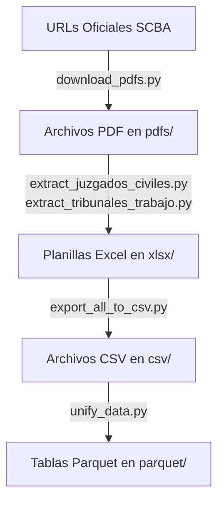

# Procesamiento de Datos - Estadísticas Judiciales (datos-jus)

Este proyecto descarga, extrae, procesa y unifica estadísticas de actividad judicial de juzgados civiles y comerciales y tribunales de trabajo de la Provincia de Buenos Aires para el período 2017-2025.

## Flujo de Datos

El pipeline de procesamiento de datos se ejecuta de extremo a extremo a través de las siguientes etapas secuenciales:



### 1. Descarga de Reportes PDF desde URLs (`download_pdfs.py`)
- **Script**: [download_pdfs.py](file:///c:/Users/jgjua/Documents/repos/datos-jus/download_pdfs.py)
- **Descripción**: Descarga de forma automatizada los reportes oficiales en formato PDF utilizando `httpx` con reintentos y control de timeouts.
- **Entrada**: Direcciones web dinámicas (URLs) de la Suprema Corte de Justicia de la Provincia de Buenos Aires (SCBA) para el rango de años de 2017 hasta el año anterior al año actual.
- **Salida**: Archivos guardados en el directorio `pdfs/` con el patrón `juzgados_civiles_anual_[año].pdf` y `tribunales_trabajo_anual_[año].pdf`.

### 2. Extracción de Datos a Excel (`extract_juzgados_civiles.py` y `extract_tribunales_trabajo.py`)
- **Scripts**: [extract_juzgados_civiles.py](file:///c:/Users/jgjua/Documents/repos/datos-jus/extract_juzgados_civiles.py) y [extract_tribunales_trabajo.py](file:///c:/Users/jgjua/Documents/repos/datos-jus/extract_tribunales_trabajo.py)
- **Descripción**: Procesan los archivos PDF descargados para extraer la información tabular de forma determinista y estructurada (sin recurrir a OCR) utilizando la biblioteca `pdfplumber` y sus parsers específicos ([pdf_parser_civiles.py](file:///c:/Users/jgjua/Documents/repos/datos-jus/pdf_parser_civiles.py) y [pdf_parser_trabajo.py](file:///c:/Users/jgjua/Documents/repos/datos-jus/pdf_parser_trabajo.py)).
- **Entrada**: Archivos PDF desde `pdfs/`.
- **Salida**: Hojas de cálculo en la carpeta `xlsx/` generadas con estilos y orden uniforme a través de sus respectivos generadores ([excel_generator_civiles.py](file:///c:/Users/jgjua/Documents/repos/datos-jus/excel_generator_civiles.py) y [excel_generator_trabajo.py](file:///c:/Users/jgjua/Documents/repos/datos-jus/excel_generator_trabajo.py)).

### 3. Exportación y Validación a CSV (`export_all_to_csv.py`)
- **Script**: [export_all_to_csv.py](file:///c:/Users/jgjua/Documents/repos/datos-jus/export_all_to_csv.py) (apoyado en [export_civil_xlsx_to_csv.py](file:///c:/Users/jgjua/Documents/repos/datos-jus/export_civil_xlsx_to_csv.py))
- **Descripción**: Convierte las planillas Excel en archivos CSV planos de 12 columnas. Este paso incluye un motor de validación riguroso que garantiza la integridad de los datos convertidos.
- **Validaciones aplicadas**:
  - Coincidencia exacta de las cabeceras requeridas.
  - Validación del número de columnas (debe ser exactamente 12).
  - Comprobación de que no existan sedes/departamentos vacíos.
  - Inferencia y verificación del año correspondiente para todos los registros del archivo (buscando en el nombre del archivo o en el encabezado de las primeras filas del libro de Excel).
  - Comprobación de la existencia de filas agregadas (`Total Provincial` y promedios) en el archivo original.
- **Entrada**: Archivos Excel en la carpeta `xlsx/`.
- **Salida**: Archivos CSV con codificación UTF-8 en la carpeta `csv/`.

### 4. Unificación y Limpieza Final a Parquet (`unify_data.py`)
- **Script**: [unify_data.py](file:///c:/Users/jgjua/Documents/repos/datos-jus/unify_data.py)
- **Descripción**: Consolida todos los archivos históricos en formato tabular unificado y normalizado aplicando transformaciones complejas con `pandas`.
- **Entrada**: Archivos CSV en `csv/`.
- **Salida**: Archivos en formato Parquet dentro de la carpeta `parquet/`.

---

## Proceso de Unificación (`unify_data.py`)

El script principal de procesamiento de datos es [unify_data.py](file:///c:/Users/jgjua/Documents/repos/datos-jus/unify_data.py). Este realiza las siguientes acciones:

### 1. Limpieza y Normalización de Sedes/Departamentos
Para garantizar la integridad y consistencia al cruzar los datos entre años y fueros, se aplica un proceso de normalización en la columna `Departamento / Sede`:
- Eliminación de espacios en blanco adicionales.
- Supresión de llamadas a notas al pie (por ejemplo, ` (1)` y ` (2)` al final de los nombres).
- Corrección de abreviaciones y discrepancias en el uso de mayúsculas/minúsculas:
  - `B. BLANCA Sede TRES ARROYOS` $\rightarrow$ `BAHIA BLANCA Sede TRES ARROYOS`
  - `MORENO-GENERAL RODRIGUEZ` $\rightarrow$ `MORENO-GRAL.RODRIGUEZ`
  - `LOMAS DE ZAMORA Sede Avellaneda` / `LOMAS DE ZAMORA Sede AVELLANEDA` $\rightarrow$ `LOMAS DE ZAMORA Sede AVELLANEDA`
  - `LOMAS DE ZAMORA Sede Lanús` / `LOMAS DE ZAMORA Sede LANUS` $\rightarrow$ `LOMAS DE ZAMORA Sede LANUS`

### 2. Filtrado de Filas Agregadas
Se descartan las filas correspondientes a `Total Provincial` y `Promedio por Juzgado` / `Promedio por Tribunal` para evitar la duplicación de datos al realizar agregaciones posteriores.

### 3. Transformación a Formato Largo (Long Format)
Las 10 columnas originales de actividad judicial (`Ingresadas`, `Sentencia`, `Conciliación`, `Allanamiento`, `Transacción`, `Caducidad`, `Desistimiento`, `Interlocutorios`, `Incompetencia`, `Total Resueltas`) se transforman (melt/unpivot) en registros individuales.
Los valores nulos o vacíos se rellenan con `0`.

---

## Estructura de Salida (Formatos Parquet)

Los archivos resultantes se guardan en la carpeta `parquet/`:

### 1. Lista Maestra de Sedes y Departamentos
Archivo: `parquet/sedes_departamentos.parquet`  
Contiene la lista única unificada de todos los departamentos y sedes de la provincia.
- **Esquema**:
  - `departamento/sede` (string): Nombre limpio y normalizado.

### 2. Tablas Unificadas por Fuero
Archivos:
- `parquet/juzgados_civiles_unificados.parquet`
- `parquet/tribunales_trabajo_unificados.parquet`

- **Esquema**:
  - `anio` (int): Año de registro (rango 2017 a 2025).
  - `departamento/sede` (string): Nombre de la sede o departamento normalizado.
  - `tipo` (string): Tipo de movimiento judicial (`Ingresadas`, `Sentencia`, `Conciliación`, etc.).
  - `valor` (int): Cantidad de causas registradas.

---

## Ejecución del Procesamiento

Para instalar las dependencias necesarias y ejecutar el pipeline, utilice `uv`:

```bash
# 1. Sincronizar el entorno de Python utilizando uv
uv sync

# 2. Ejecutar el pipeline completo de extremo a extremo
# Por defecto realiza una ejecución incremental para el último año estadístico publicado (año actual - 1)
uv run python main.py

# Alternativas de ejecución:

# Ejecutar el pipeline completo reconstruyendo todo el histórico (2017-presente)
uv run python main.py --all

# Ejecutar de forma incremental para un año específico
uv run python main.py --year 2024
```
